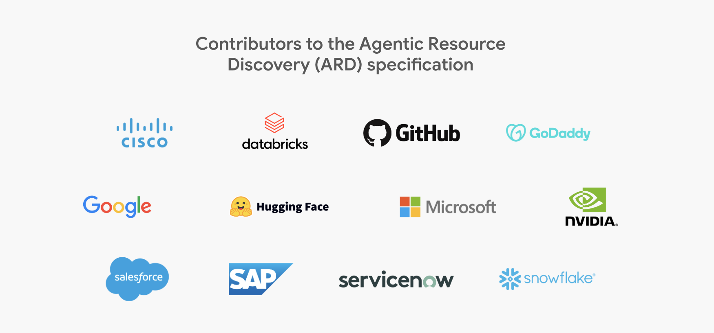

# Agentic Resource Discovery Specification

ARD is an open discovery protocol for agentic resources. It allows an AI client to ask: *"What is available for this task?"* and lets a discovery service answer with matching resources.

ARD sits entirely before invocation. It helps the client find the right resource; the resource is then invoked through its own native mechanism.

## What is an agentic resource?

An agentic resource is any external capability an AI client can call on to do a task — an agent, MCP server, Skill, Canvas, Plugin, API, or workflow — anything that can be represented as an [AI Catalog entry](ai_catalog_spec.md).

## What ARD is not

**It is not an execution runtime:** ARD is not MCP, A2A, Skills, AI Catalog, or an API runtime, and it does not replace them.

**It is not a central catalog:** There will be many discovery services, each indexing different resources, serving different communities, and applying its own trust, ranking, and access policies. Every enterprise can run its own — much like an intranet has its own search engine over internal content. And on the public web there will be many, some optimizing for quality and trust, others for coverage.

## Who is behind ARD?

ARD is being developed by a working group with participants from Microsoft, Google, Hugging Face, GoDaddy, and others. This work is part of a broader effort to create an open discovery layer for resources that AIs can draw on.

To understand the motivation and design, start with the [Introduction](introduction.md).

{ .logo-wall }
